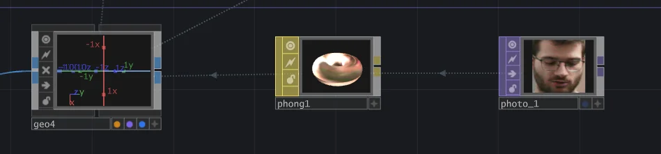
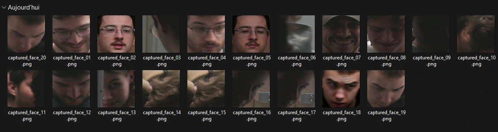

# Palmarès

## 1. Terminal

**Créateurs et créatrices : Émeryk Bélisle, Elie Daher, Ting Yung Lu Terry, Dana Saavedra-Torrano et Mégane Ranger**

> Vue d'ensemble de Terminal (photo prise par Rosa-Lee Savoie)

> Implantation de Terminal (source : [Terminal_GitHub](https://pythons-5.github.io/Terminal/technique/diagrame2d3.png))

### Mon ressenti

Avant d'essayer *Terminal*, j'avais une impression globalement positive. La bande-annonce avait piqué ma curiosité et je trouvais l'esthétique pixelisée vraiment réussie.

Lors de mon premier test, j'ai réalisé que c'était un jeu coopératif, ce que je n'avais pas compris au départ. De plus, je n'arrivais pas à faire le lien entre l'expérience réelle et la mise en contexte proposée dans la description du jeu.

Par contre, lors de mon deuxième test, le problème de mise en contexte à été corrigé en l'affichant avant le commencement de la partie. C'est aussi à ce moment que j'ai remarqué un bug assez important qui nuisait à une partie de l'expérience.

Globalement, malgré certaines critiques, je trouve le jeu bien pensé et bien exécuté. Même si le jeu est simple et ne réinvente pas la roue, il reste très efficace et amusant.

## 2. Mission Décollage
**Créateurs : Ahmed Kaissoumi, Radhouane Kordan, Justin Montpetit, Thearylou Lach et Jad Saloumi**

> Vue d'ensemble de Mission Décollage (photo prise par Rosa-Lee Savoie)

> Implantation de Mission Décollage (source : [Mission_GitHub](https://o-i-g-n-o-n.github.io/Mission-decollage/medias/images/implantation.png))

### Mon ressenti

Avant d'essayer *Mission Décollage*, j'avais une idée clair de son fonctionnement et il me semblait bien avancé. D'après la description des contrôles du jeu, j'ai compris que celui-ci avait été refléchi en profondeur.

Lors de mon premier test, je n'ai pas été déçu, car l'expérience répondait bien à mes attentes. Par contre, le jeu est long et est complexe avec ses nombreuses commandes, ce qui peut rendre l'expérience exigeante et parfois faire décrocher les joueurs.

Quand j'ai réesayer le jeu plus tard, j'ai remarqué que des indications avaient été ajoutées pour expliquer les contrôles. Sinon, l'expérience restait identique à la première fois, ce qui n'est pas surprenant puisqu'elle était déjà bien développée.

Globalement, le jeu est réussi dans son ensemble et propose une expérience immersive et originale. Cependant, la complexité des contrôles et le thème sur l'aérospatiale me donnaient personnellement moins envie d'y jouer.

## 3. Arbre en face
**Créateurs : Alexandre Gendron, Mikael Arseneau, Mathieu Willett, Matis Ghariani et Rafael Angon Dube**

> Vue d'ensemble d'Arbre en face (photo prise par Rosa-Lee Savoie)

> Implantation d'Arbre en face (source : [Arbre_en_face_GitHub](https://github.com/user-attachments/assets/a38288bd-df49-4a2c-a91d-1658fbaf32a2))

### Mon ressenti

Avant d'expérimenter *Arbre en face*, je ne comprenais pas totalement son utilité ni son fonctionnement. La bande-annonce était très comique, mais n'apportait pas vraiment d'informations claires.

Lors de mon premier test, j'ai découvert le principe simple de l'œuvre, qui consiste à placer sa main sur une surface de projection et à la lever pour faire pousser des arbres virtuels accompagnés de sons comiques.

Quand j'ai réessayer un autre jour, certaines fonctionnalités qui causaient des bugs avaient été retirées, tandis que d'autres avaient été ajoutées. Le principe et le côté comique sont restés les mêmes.

Globalement, je suis mitigé face à cette expérience. Même si celle-ci est amusante et mémorable, le manque de clarté quand à l'intention m'a moins convaincu.

## 4. Océan rouge
**Créatrices : Amira Tounekti et Kristy Moussally**

> Vue d'ensemble d'Océan rouge (photo prise par Rosa-Lee Savoie)

> Implantation d'Océan rouge (source : [Ocean_rouge_GitHub](https://deux-intelligence.github.io/deux-neurones/technique/plan_implantation_01.drawio.png))

### Mon ressenti

Avant d'expérimenter *Océan rouge*, le principe du jeu ne me donnait pas vraiment envie et je le trouvais peu abouti. La bande-annonce ne présentait pas une expérience engageante ni d'objectifs précis.

Lors de mon premier test, j'ai trouvé les contrôles simples et intuitifs (à l'exception d'un contrôle), mais j'avais l'impression de ne rien faire. Sans progression ni objectifs, il n'y avait pas vraiment de raison d'y jouer.

Par contre, lors de mon deuxième essai, les contrôles étaient clairement indiqués et un objectif avait été ajouté. Il fallait maintenant récolter un certain nombre de déchets pour gagner la partie.

Globalement, le jeu reste très simple, mais les améliorations ont contribué à donner un minimum de sens au projet. Le jeu pourrait être développer davantage pour offrir une vraie expérience.

## 5. Quand les yeux se croisent
**Créatrices et créateur : Edelwyn Ledru, Félix Lavoie, Jade Hébert, Manel Yaya et Patricia Nassif**

> Vue d'ensemble de Quand les yeux se croisent (photo prise par Rosa-Lee Savoie)

> Implantation de Quand les yeux se croisent (source : [Quand_les_yeux_GitHub](https://emersiaa.github.io/Quand-les-yeux-se-croisent/technique/plan_plantation_03.jpeg))

### Mon ressenti

Avant d'expérimenter *Quand les yeux se croisent*, j'ai eu l'impression que l'œuvre était complexe et ça m'intéressait. La bande-annonce ne donnait aucune information, mais laissait tout de même place à une certaine surprise.

Lors de mon premier test, j'ai été surpris par l'installation, qui est presque une œuvre en soi avec les télévisions rétro et la décoration qui les accompagne. Par contre, j'ai trouvé l'expérience de se voir dans les écrans peu intéressante et même un peu dérangeante.

Le deuxième test était similaire, car peu de choses semblaient avoir changé entre-temps, ce qui est dommage. L'installation restait essentiellement la même, ce qui laissait une impression de stagnation.

Globalement, il ne se passe pas grand chose et l'interaction est très limitée, ce qui rend l'expérience peu engageante. Le concept pourrait être repensé, car il y aurait selon moi de la place pour une expérience plus immersive et interactive.

## Les cours qui me semblent les plus incontournables pour réaliser ce type de projet

### 1. Interactivité ludique

Le cours d'interactivité ludique me semble essentiel, car il permet d'apprendre à concevoir des expériences interactives, notamment sous forme de jeux.

### 2. Modélisation 3D

Le cours de modélisation 3D est important puisqu'il permet de créer ses propres éléments visuels. Cela donne la possibilité de produire des objets et des environnements adaptés sans dépendre de ressources externes.

### 3. Objets interactifs

Le cours d'objets interactifs est essentiel pour comprendre comment fonctionnent les capteurs et les systèmes physiques (ex. : boutons), qui sont essentiels pour l'interactivité.

## Technique que je ne connaissais pas

Une technique que je ne connaissais pas est le système de détection de visage utilisé dans le projet Arbre en face, réalisé avec le logiciel TouchDesigner.

Dans cette installation, une caméra détecte automatiquement le visage des visiteurs. Lorsqu’un visage est repéré, une photo est prise et elle est enregistrée dans un dossier avec plein d’autres visages.

> Système de détection faciale avec TouchDesigner (source : [Arbre_en_face_Github](https://github.com/user-attachments/assets/5909ac9a-2e87-4c61-8f95-69ce5fba0927))

> Dossier des visages photographiés (source : [Arbre_en_face_Github](https://github.com/user-attachments/assets/1710c7d3-4d27-4048-a458-84a3bd1ac588))

Par la suite, lorsque les visiteurs interagissent avec l’installation, le système récupère ces images dans le dossier pour les afficher dans la projection.

J’ai trouvé intéressant de voir comment des images capturées à l’avance peuvent être utilisées pour ajouter un peu d’humour, surtout quand on voit son visage sur la projection sans savoir comment elle a été prise.

