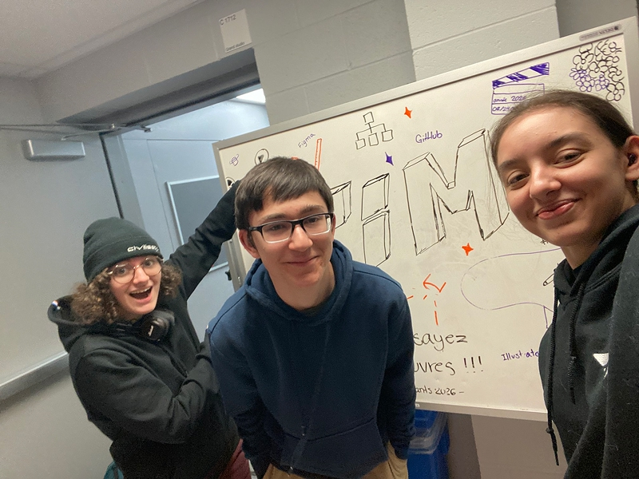
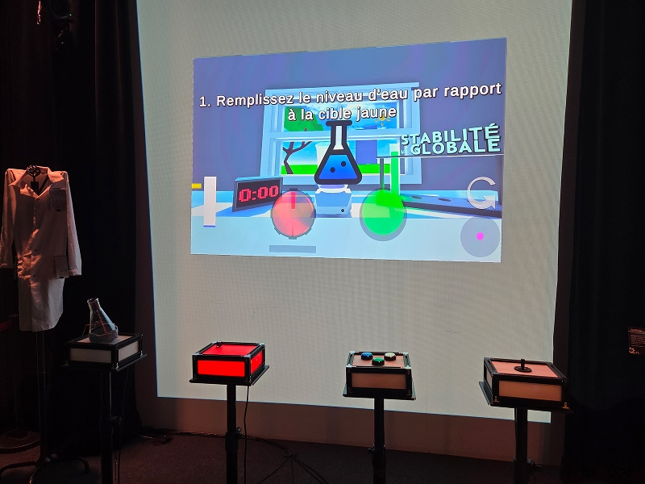
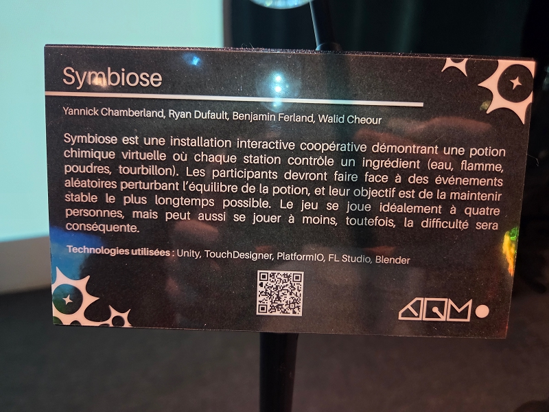
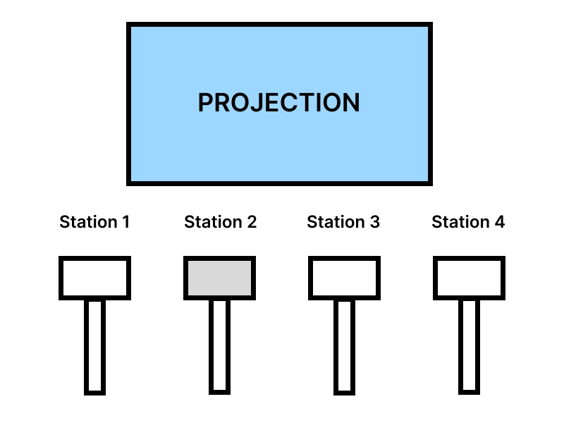
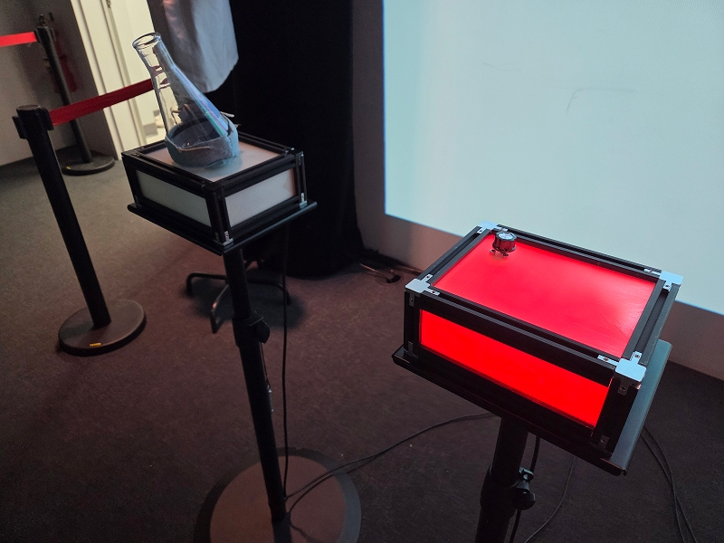
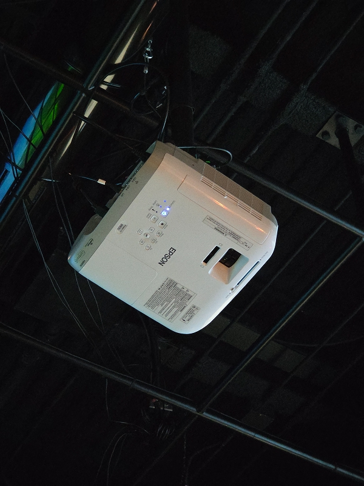

# *Réseau vivant*

**Exposition temporaire présentée dans le studio TIM, visitée le 24 février 2026 et le 17 mars 2026.**

> Théana Leurot, moi et Anne-Julie Labrie (de gauche à droite) devant l’affiche à l’entrée de l’exposition

## *Symbiose*

Le jeu *Symbiose* a été conçu et réalisé par Yannick Chamberland, Benjamin Ferland, Ryan Dufault et Walid Cheour de **2025 à 2026**.

> Vue d’ensemble du dispositif

### Description du dispositif

*Symbiose* est une installation interactive coopérative dans laquelle les participants doivent maintenir la stabilité d’une potion virtuelle le plus longtemps possible. Le dispositif est composé de quatre stations, chacune contrôlant un paramètre différent de la potion.

Une première station utilise un Erlenmeyer équipé d’un accéléromètre, permettant de détecter les mouvements et de faire couler un liquide dans la fiole. Une deuxième station contrôle la température à l’aide d’une molette rotative afin de maintenir la potion à une certaine chaleur. Une troisième station repose sur des boutons de couleur permettant d’ajouter des poudres dans la potion. Enfin, une quatrième station utilise une manivelle permettant de mélanger la potion en contrôlant un mouvement selon les axes X et Y.

Au cours de la partie, des événements aléatoires viennent perturber l’équilibre de la potion. Les joueurs doivent alors coordonner leurs actions pour stabiliser la situation. Après un certain nombre d’erreurs, la partie prend fin.

> Cartel du dispositif

### Type d’installation

Il s’agit d’une installation interactive ludique qui repose sur la coopération entre plusieurs participants. Elle invite les joueurs à interagir physiquement avec différents dispositifs afin d’atteindre un même objectif

### Fonction du dispositif

Le dispositif a pour fonction de proposer une expérience collaborative basée sur la coordination. Il met les participants au défi de communiquer et d’agir ensemble efficacement afin de maintenir l’équilibre de la potion et d’atteindre le meilleur score possible.

### Mise en espace

Le dispositif est situé directement à gauche en entrant dans le studio TIM, ce qui en fait l’une des premières installations visibles.

> Croquis du dispositif vu de face

> Croquis du dispositif dans le studio vu de haut

### Composantes et techniques

Le dispositif repose sur plusieurs types d’interactions physiques réparties en quatre stations.

> À gauche : Erlenmeyer équipé d’un accéléromètre permettant de détecter l'orientation et de faire couler le liquide dans le jeu. À droite : molette rotative utilisée pour contrôler la température de la potion.

> À gauche : boutons de couleur permettant d’ajouter des poudres dans la potion. À droite : manivelle permettant de mélanger la potion en contrôlant un mouvement selon les axes X et Y.

Le système utilise des microcontrôleurs de type M5Stack ainsi que différents capteurs pour transmettre les données au système principal.

### Éléments nécessaires à la mise en exposition

La mise en exposition nécessite un projecteur, une surface de projection blanche, un système de son, ainsi qu’un éclairage.

> Projecteur utilisé pour afficher l'écran du jeu

> Éclairage ambiant et haut-parleurs pour l'installation

### Expérience vécue

Lors de ma visite, j’ai participé au jeu avec d’autres personnes en occupant l’une des stations. Chaque joueur devait contrôler un paramètre spécifique afin de maintenir la stabilité de la potion.

Comme nous étions trois joueurs plutôt que quatre, j’ai dû gérer deux stations en même temps, ce qui augmentait la difficulté. Malgré tout, nous avons réussi à battre le record du jeu, ce qui nous a vraiment rendu content.

### Ce qui m’a plu et m’a moins plu

J’ai apprécié l’aspect coopératif du dispositif. Le fait que chaque joueur ait un rôle différent rend l’expérience immersive et engageante et donne le goût de recommencer pour essayer chaque station.

Ce que j’ai moins aimé, c’est que les instructions n’étaient pas toujours assez claires au début. De plus, le jeu est moins équilibré lorsqu’il y a moins de quatre joueurs, ce qui augmente la difficulté de manière importante.

## Références

Les photos ont été prises par moi-même (Thomas Bozelko) et Anne-Julie Labrie.
Site web de l'exposition :  [Réseau vivant](https://tim-montmorency.com/2026/)
Site web du dispositif :  [Symbiose_Github](https://les-chimistes.github.io/symbiose/#/)
