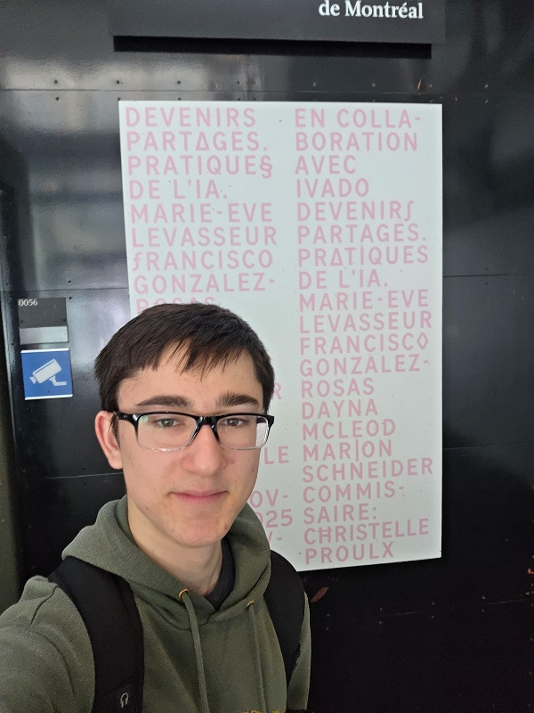
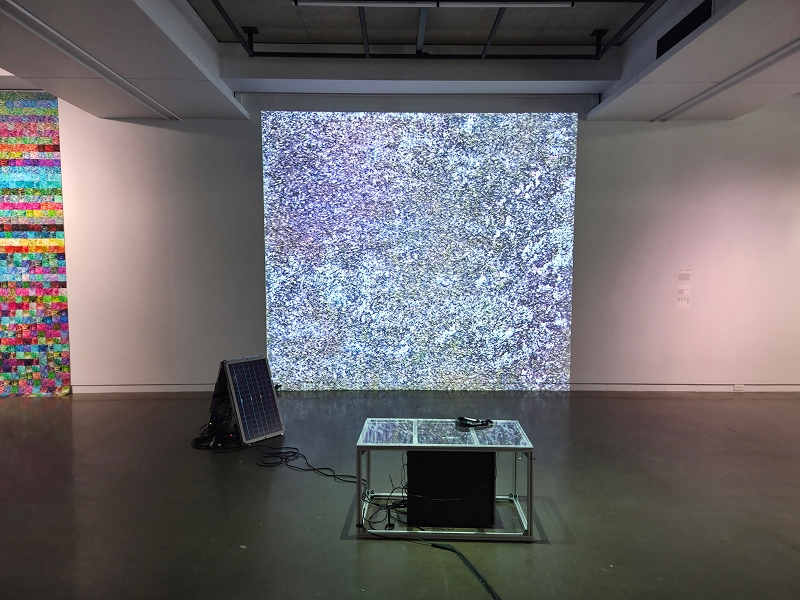
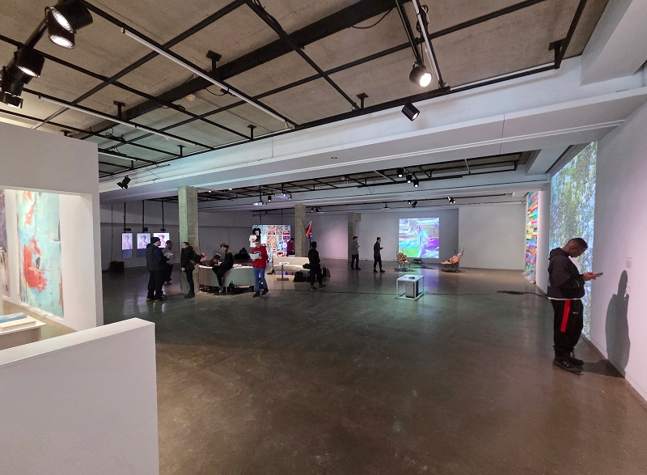
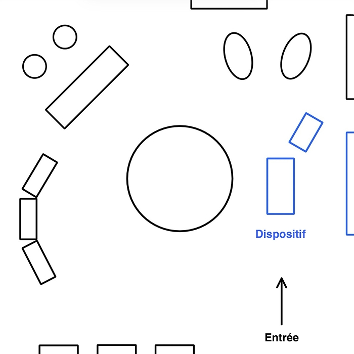
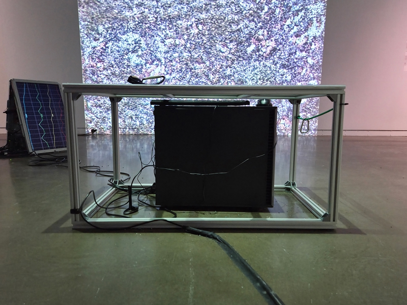
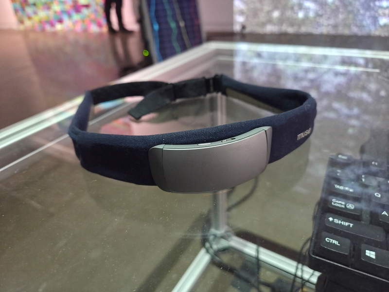
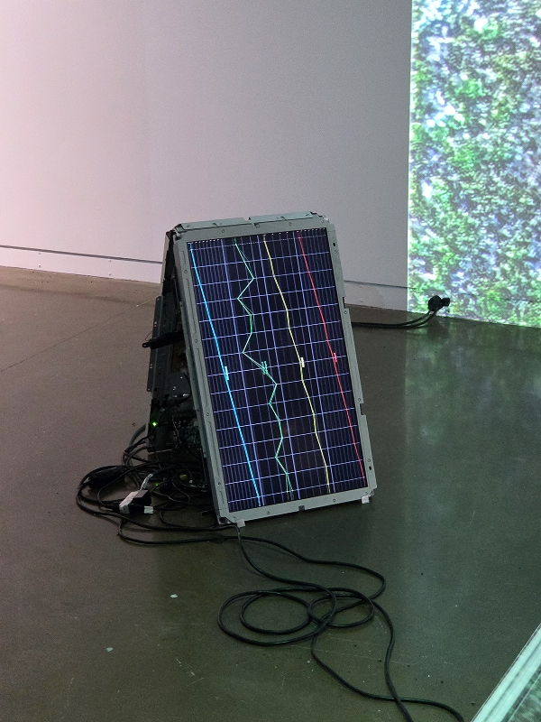
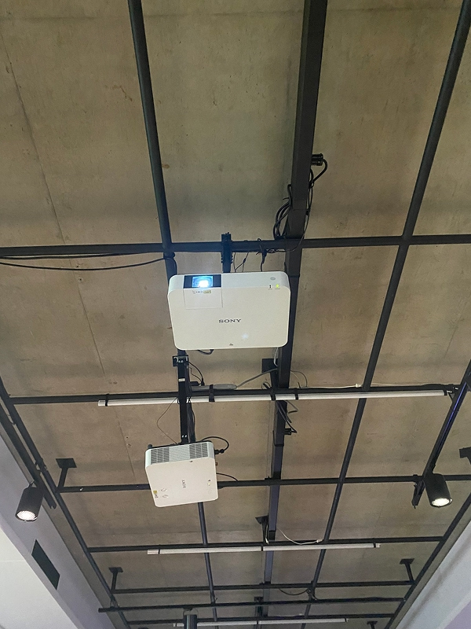
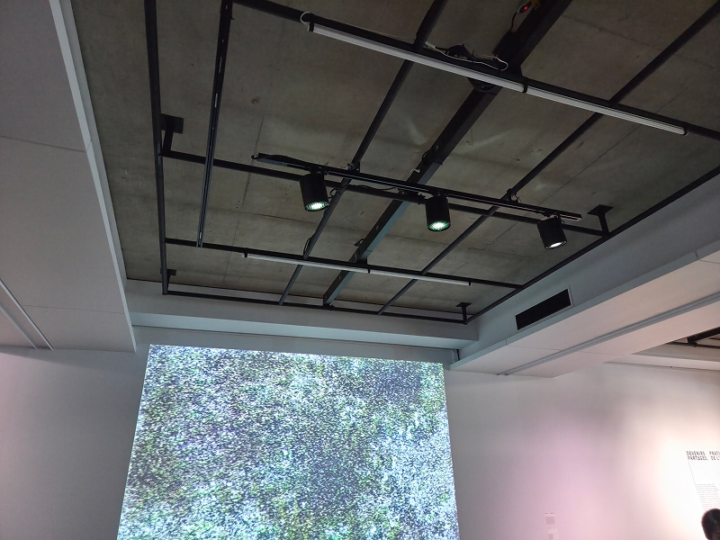
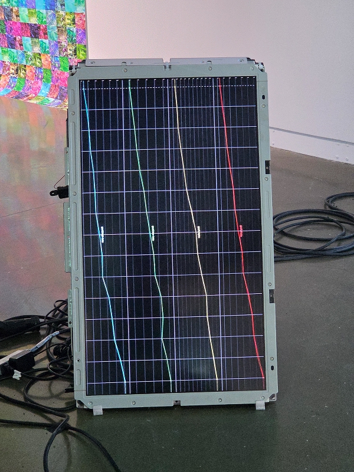

# Devenirs partagés. Pratiques de l'IA.

**Exposition temporaire présentée à la Galerie de l'Université de Montréal et visitée le 30 janvier 2026.**

> Moi devant l'affiche de l'exposition  

> Moi devant l'entrée de l'exposition

## *Terre commune*

Le dispositif *Terre commune* a été réalisé par **Marion Scheider** en 2025.

> Vue d'ensemble de *Terre commune*

### Description du dispositif

*Terre commune* explore les liens entre l'humain, la machine et la nature. **Marion Scheider** a utilisé des photos de sols forestiers, prises dans les Laurentides, pour entraîner une IA à générer de nouvelles images à partir de ces données. 

Pendant l'exposition, des images générées en temps réel sont projetées sur un mur de la galerie. La projection est directement influencée par l'activité cérébrale liée au calme des personnes qui expérimentent le dispositif. L'idée est de connecter l'utilisateur à la fois avec avec la machine et avec la nature. Le « cerveau » du disposif (l'ordinateur) est situé sous le banc, ce qui renforce cette connexion une fois l'utilisateur assis.

> Texte explicatif de *Terre commune*

### Type d'installation

C'est une installation interactive qui combine plusieurs technologies.

Les utilisateurs sont invités à porter un casque qui capte les ondes cérébrales et qui est relié à un ordinateur équipé d'un modèle génératif d'images produisant la projection en direct.

> Vue d'ensemble de l'exposition

### Fonction du dispositif

Le dispositif sert à créer une interaction entre les ondes cérébrales des utilisateurs et la machine. Il cherche à montrer une facette plus collaborative et positive de l'intelligence artificielle.

### Mise en espace

Le dispositif est installé près de l'entrée, ce qui en fait la première oeuvre de l'exposition. On y trouve un banc placé face au mur où la projection est présentée. Un écran affiche également l'activité cérébrale de l'utilisateur en temps réel, ce qui permet de visualiser les variations des ondes mesurées.

> Croquis de l'exposition vu de dessus

> Croquis de *Terre commune* vu de face

### Composantes et techniques

Le dispositif est composé d'un ordinateur situé sous le banc en verre, relié à un casque EEG ainsi qu'à un écran permettant de visualiser les ondes. Les variations de celles-ci influencent la création en temps réel des images, qui sont projetées sur le mur grâce à un vidéoprojecteur.

> Ordinateur sous le banc en verre

> Casque EEG pour la détection des ondes

> Écran pour visualiser les ondes

> Vidéoprojecteur pour afficher les images (photo prise par Anne-Julie Labrie)

### Éléments nécessaires à la mise en exposition

Comme mentionné plus haut, il faut un banc et un projecteur pour le dispositif. Un éclairage dirigé vers le banc met l'emphase sur la personne qui expérimente l'installation.

> Éclairage du dispositif

### Expérience vécue

Je me suis installé sur la banc et j'ai placé le casque sur mon front. Je pouvais voir plusieurs lignes représentant différentes ondes cérébrales, dont les ondes alpha, représentées par la ligne jaune. En temps normal, cette ligne bougeait rapidement, alors que lorsque j'étais détendu, elle bougeait à peine. Normalement, ces variations devaient changer l'image générée, mais ce changement était tellement minime que je ne l'ai même pas remarqué.

> Écran avec les lignes vues de près

### Ce qui m'a plu

J'ai aimé l'idée de relier la technologie à un aspect humain et naturel. C'est une facette de l'IA que je n'aurais jamais imaginée. J'ai trouvé le concept fascinant, même si je pense qu'il aurait pu être exploité davantage.

### Ce que je ferai autrement

J'aurais aimé que les variations d'images sont plus prononcées, afin de voir une réelle différence quand on met le bandeau et qu'on se détend. Cela renforcerait l'expérience.

### Références

Photos prises par Thomas Bozelko (et Anne-Julie Labrie)  
Site web de l'exposition : https://galerie.umontreal.ca/devenirs-partagees-pratiques-de-lia.php
