# Lumino - *Entre maintenant et l’infini*

**Exposition temporaire** présentée au **Centre Eaton de Montréal** et visitée le **20 février 2026**.

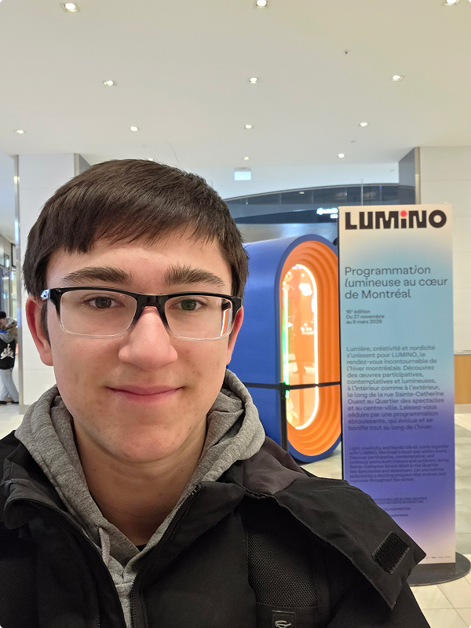

> Moi devant l’affiche de l’exposition

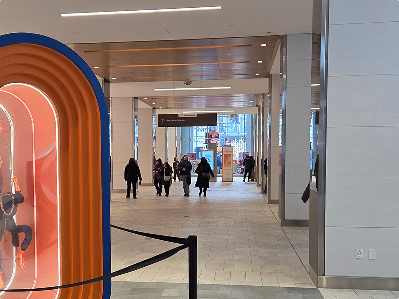

> Entrée du Centre Eaton de Montréal

L’œuvre *Entre maintenant et l’infini* a été réalisée par **Jeremy Shantz** et était présentée du **27 novembre 2025** jusqu'au **8 mars 2026**.

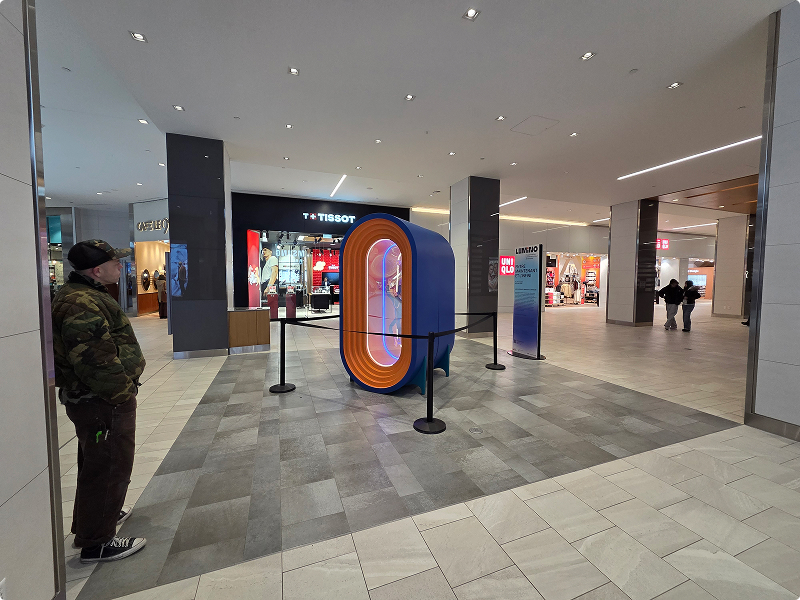

> Vue d’ensemble de l’œuvre (l'artiste est à gauche dans la photo)

## Description de l’œuvre

*Entre maintenant et l’infini* est une installation lumineuse qui joue avec les reflets pour créer une illusion d’infini.

L’œuvre est constituée de deux grandes structures ovales en bois peint, placées dos à dos et fermées par une vitre semi-réfléchissante. À l'intérieur, des éléments sont suspendus devant un miroir, ce qui multiplie leur reflet et donne l'impression d'un couloir sans fin.

D’un côté, une tige transparente est éclairée par des lumières vertes, et deux fleurs métalliques sont attachées aux extrémités.

De l’autre côté, une statue d’enfant bleu, sans tête, avec les mains et les pieds dorés, lève les bras vers une fleur métallique placée au-dessus d'elle.

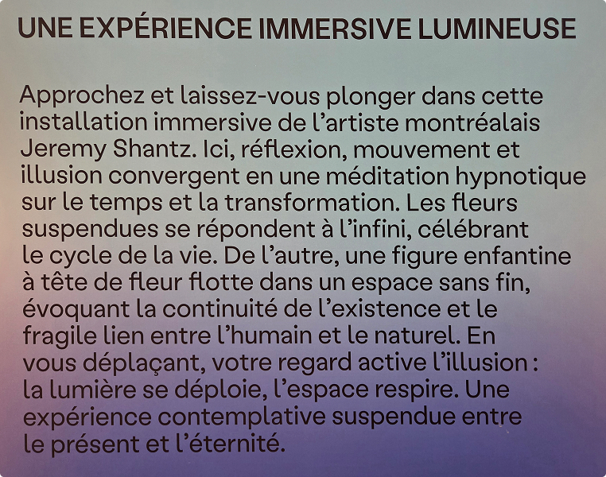

> Cartel de l’œuvre

## Type d’installation

C’est une installation immersive qui joue avec la perception visuelle du spectateur. Elle combine des miroirs, vitres semi-réfléchissantes, lumière DEL et sculptures afin de créer une illusion d’infini.

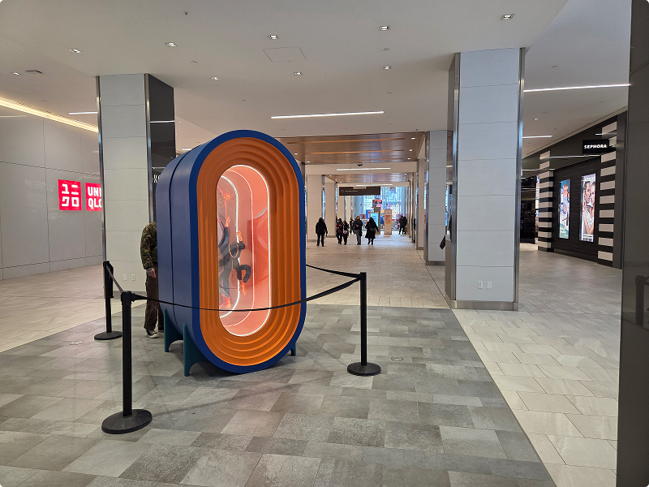

> Vue d’ensemble du lieu d’exposition

## Fonction de l’œuvre

L’œuvre crée une illusion visuelle qui donne l’impression d’un couloir sans fin. Elle invite le spectateur à réfléchir à la relation entre le présent et l’infini.

## Mise en espace

L’œuvre est installée près d’une des entrées du Centre Eaton. Cet emplacement est stratégique puisque plusieurs personnes y circulent et ça permet d'exposer les deux côtés. Les passants peuvent donc y jeter un coup d’œil.

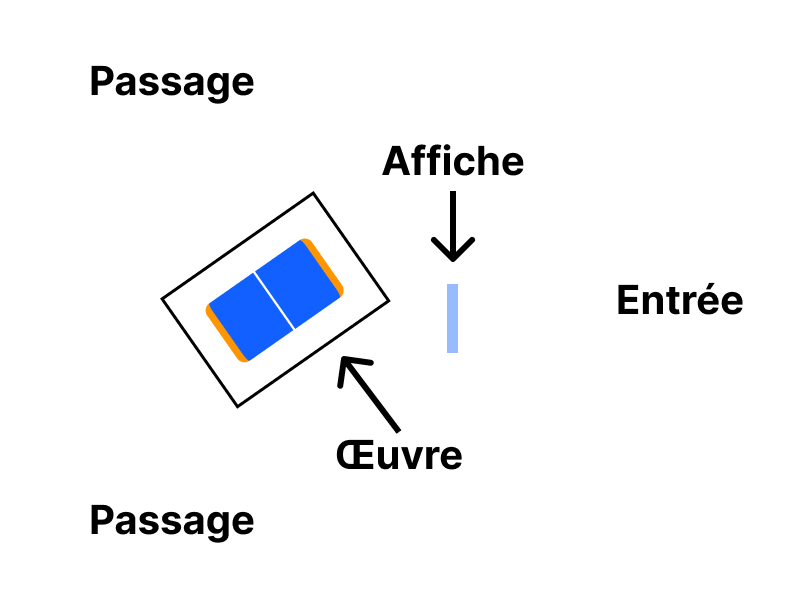

> Croquis de l’entrée vue de haut

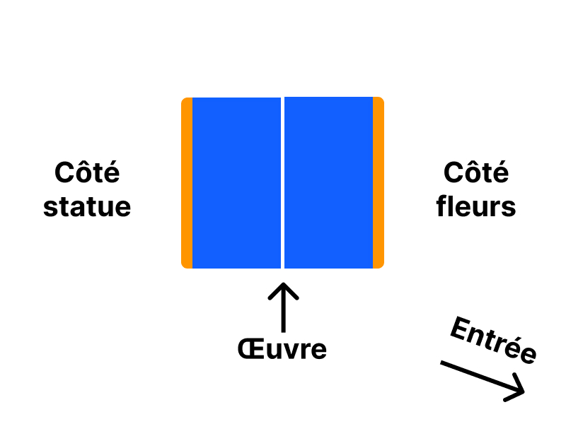

> Croquis de l’œuvre vu de côté

## Composantes et techniques

L’œuvre est constituée de deux structures ovales en bois peint, qui tiennent sur des supports au sol.

Chaque structure contient :

- une vitre semi-réfléchissante à l’avant,

- un miroir placé à l'arrière,

- des bandes DEL blanches autour de la vitre,

- des bandes DEL colorées autour du miroir qui changent de couleur au fil du temps.

D’un côté, une tige transparente est éclairée par des lumières vertes, et deux fleurs métalliques sont attachées aux extrémités.

De l’autre côté, une statue d’enfant bleu, sans tête, avec les mains et les pieds dorés, lève les bras vers une fleur métallique placée au-dessus d'elle.

Les lumières sont alimentées par des câbles qui passent dans le sol, cachés entre les deux structures.

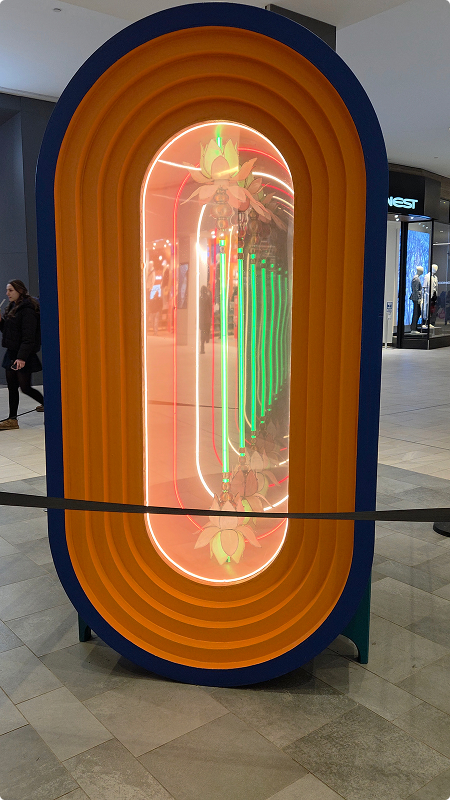

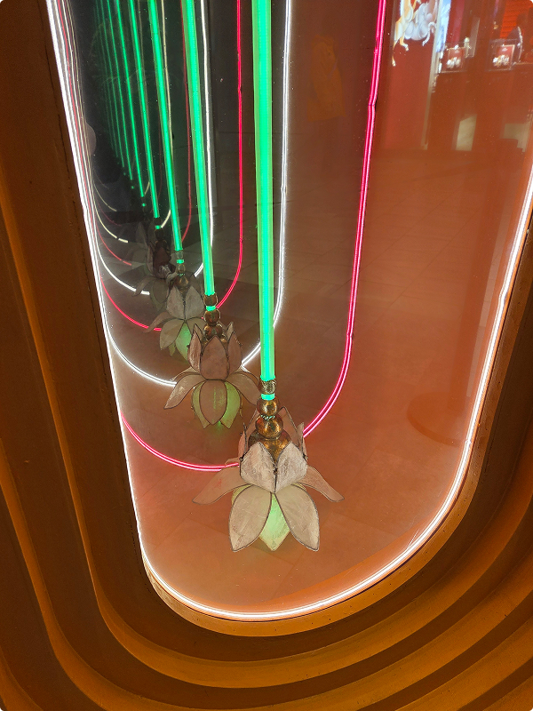

> Structure avec les fleurs

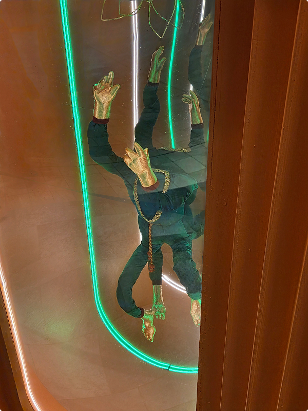

> Structure avec la statue

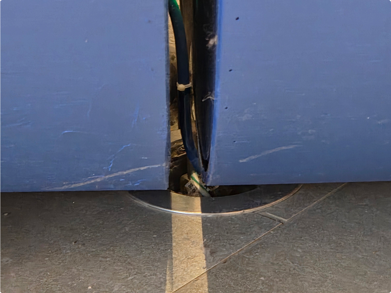

> Câbles entre les structures

## Éléments nécéssaires à la mise en exposition

L'installation nécessite :

- des lumières pour l'éclairage,

- une barrière pour protéger l'œuvre,

- une affiche posée sur une base.

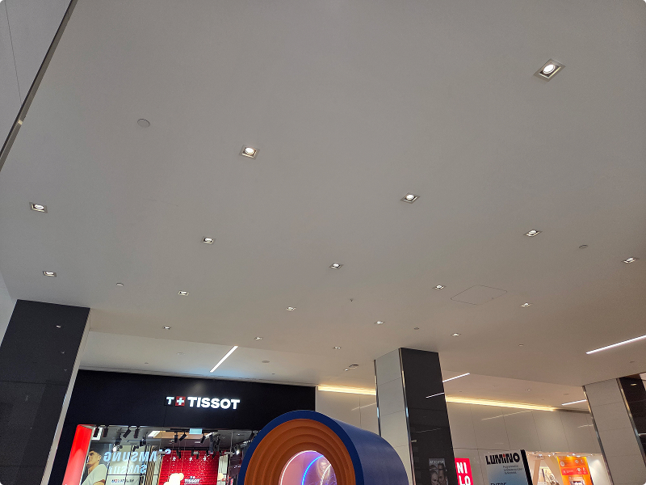

> Éclairage du Centre Eaton

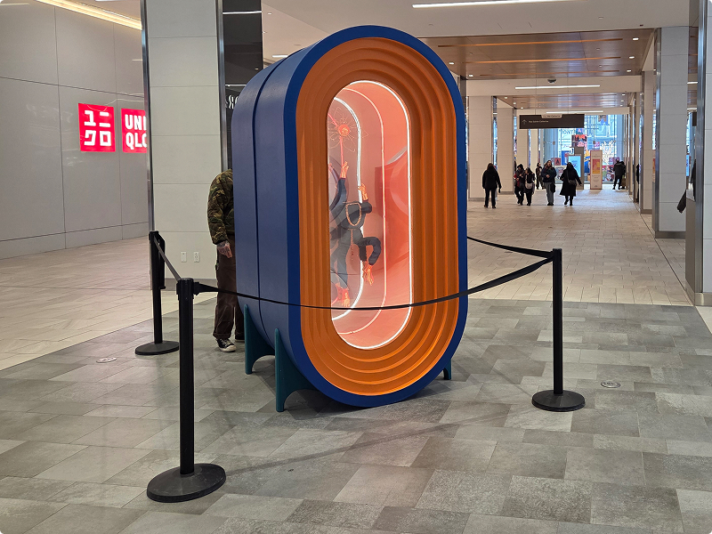

> Barrière autour de l'œuvre

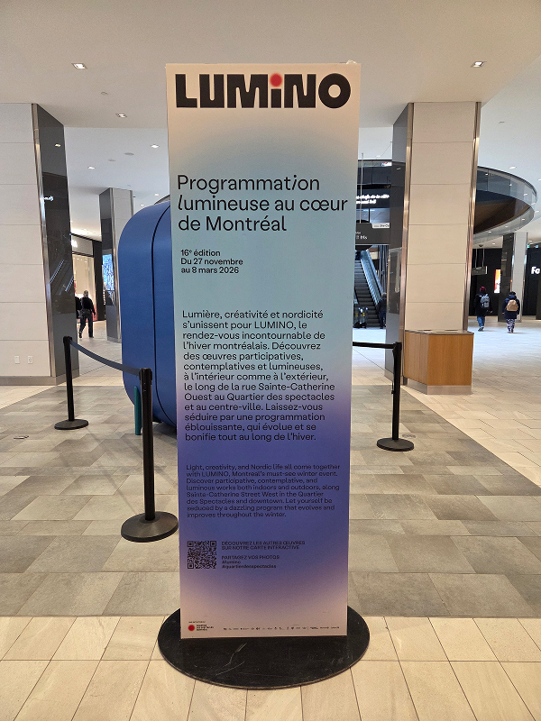

> Affiche de l'exposition

## Expérience vécue

En entrant dans le centre Eaton, j'ai vu l'œuvre qui était installée au milieu du couloir. En m'approchant, j'ai été surpris par l'effet de tunnel infini provoqué par les réflexions. C'était impressionnant, surtout que je ne comprenais pas encore comment ça fonctionnait. Après avoir fait mes recherches, j'ai compris que la vitre reflète seulement d'un côté, ce qui crée l'illusion lorsqu'elle est placée face au miroir.

De plus, au moment de ma visite, j'ai remarqué un homme qui se promenait autour de l'œuvre comme moi. Plus tard, en faisant une recherche sur l'artiste, j'ai réalisé que c'était lui! Dommage de ne pas avoir eu la chance de lui parler.

## Ce qui m'a plu et m'a moins plu

J'ai aimé l'illusion provoquée par les reflets. Je suis convaincu qu'il est possible de réaliser un projet intéressant avec une vitre semi-réfléchissante.

Ce que j'ai moins aimé, c'est que l'éclairage ambiant provoquait des reflets de notre côté de la vitre, ce qui rendait difficile de voir l'intérieur et de prendre des photos. L'œuvre aurait pu être présentée dans un espace plus adapté.

# Références

Toutes les photos ont été prises par moi-même (Thomas Bozelko).  
Site web de l'exposition : https://www.luminomtl.com/fr/activites/oeuvres-interieures/entre-maintenant-et-l-infini
